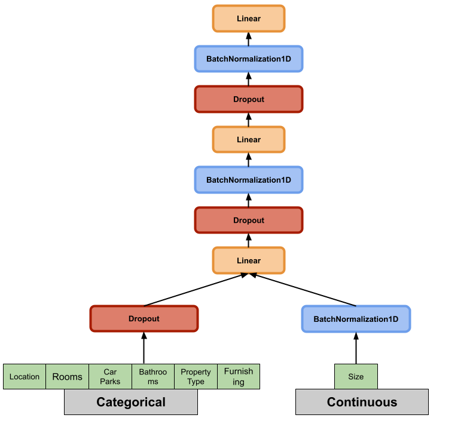
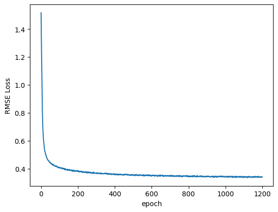

# Malaysia House Price Prediction

## About the dataset

The house price dataset was obtained from Kaggle and published 
at year 2019 (I knew it was a bit outdated for now). 
This dataset contained 6 features column: which are *Location*, *number of rooms*,
*number of bathrooms*, *number of car parks*, *Area of House (Size)* as per square feet,
*property type* and the *status of furnishing*. 

## Model Setup

The tabular data will be seperates into categorical and 
continuous parts. The categorical columns will first 
embedded beased on the previous sizes and concatenate the 
embedding vectors with continuous part to form the input 
tensor of ther rest of the network.

The following diagram demonstrates the neural network
model I've used:

## Training process

In this project, I've used Adam optimizer to reduce the rooted 
mean square error (RMSE). The training process is simple: 
by iterating each batch with size 1200, do forward propagation,
compute gradient and repeat this process again and again, until 
the epochs reached.

## Performance

We use RMSE as the metric for this neural network regression model.

The loss is now converges to roughly 0.34, implies that the accuracy 
is around 66%. 

TODO: Try to features-engineering to make RMSE to be more lower.